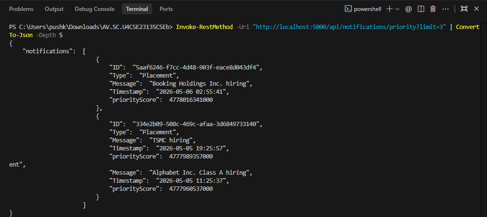

# Campus Notification Platform - System Design Document

A comprehensive, full-stack real-time notification engine engineered for university campus environments. This platform facilitates the delivery of critical updates regarding Placements, academic Results, and campus Events with high reliability, low latency, and intelligent prioritization.

## Architectural Overview

The system is architected as a distributed monorepo, emphasizing modularity, observability, and separation of concerns.

- **Frontend (notification_app_fe)**: A responsive, high-performance web application built with Next.js and TypeScript. It utilizes server-side rendering for optimal performance and WebSockets for real-time interactivity.
- **Backend (notification_app_be)**: A robust Node.js and TypeScript API service that handles core business logic, algorithmic scoring for the Priority Inbox, and database orchestration.
- **Logging Middleware (logging_middleware)**: A standalone, reusable telemetry package designed for cross-stack observability, ensuring consistent error tracking and event logging.
- **System Design (notification_system_design.md)**: A living document detailing the evolution of the system's architecture, from initial API contracts to complex distributed notification workflows.

---

## Technical Deep-Dive by Stage

### Stage 1: API Design and Real-time Communication
**Objective**: Establish a scalable communication contract and real-time delivery mechanism.
- **REST Contract**: Developed a highly predictable API for fetching notifications, managing read states, and unread counts.
- **Real-time Engine**: Integrated WebSockets (Socket.io) to ensure students receive critical alerts without manual page refreshes.
- **Technical Decision**: Chose WebSockets over Long Polling to minimize server overhead and provide instantaneous delivery, crucial for time-sensitive placement alerts.

### Stage 2: Data Persistence and Schema Engineering
**Objective**: Design a storage layer capable of handling millions of records while maintaining relational integrity.
- **Database Selection**: Chose PostgreSQL for its ACID compliance and advanced support for JSONB and indexing.
- **Schema Design**: Implemented a normalized structure with a dedicated junction table to track read/unread status on a per-student basis.
- **Scaling Strategy**: Identified and documented the need for horizontal partitioning (Sharding) by student ID to prevent performance degradation as the user base grows.

### Stage 4: High-Performance Caching and Scaling
**Objective**: Mitigate database bottlenecks caused by concurrent read requests from 50,000+ students.
- **Caching Layer**: Proposed an in-memory caching strategy using Redis for high-frequency queries such as "Unread Badge Count."
- **Read Replicas**: Outlined a strategy to offload read-heavy GET requests to multiple DB replicas, preserving the primary instance for write operations.
- **Trade-off Analysis**: Documented the balance between Cache Consistency and Read Performance, opting for a Write-Through cache invalidation strategy.

### Stage 5: Reliable Distributed Notification Delivery
**Objective**: Ensure 100% delivery reliability for mass notifications (50,000+ recipients) without system timeouts.
- **Asynchronous Processing**: Transitioned from synchronous loops to a Message Queue architecture (Producer-Consumer pattern).
- **Chunking Logic**: Implemented batch processing (1,000 recipients per job) to manage memory usage and database connection pools effectively.
- **Fault Tolerance**: Developed a retry mechanism with exponential backoff for failed external service calls (e.g., Email API), ensuring transient failures do not lead to data loss.

### Stage 6: Priority Inbox and Algorithmic Sorting
**Objective**: Surface the most critical notifications (Placements) at the top of the user's feed regardless of volume.
- **Scoring Algorithm**: Developed a weighted priority formula: Priority Score = (Weight * 10^12) + Timestamp_in_ms.
- **Weight Assignments**: Placement (3) > Result (2) > Event (1). This ensures categorical precedence.
- **Data Structure**: Leveraged a Min-Heap of size 10 to maintain the top notifications in memory with O(log n) update complexity, ensuring the interface remains fluid even during high notification throughput.

#### Backend API Verification
Below is the output from the priority endpoint, demonstrating the algorithmic scoring in action:

### Stage 7: Production-Grade Frontend Implementation
**Objective**: Deliver a responsive, state-aware interface that distinguishes between new and viewed alerts.
- **State Management**: Implemented a robust React context for tracking unread states and managing real-time WebSocket updates.
- **Responsive Design**: Utilized Material UI and Vanilla CSS to provide a consistent experience across mobile and desktop breakpoints.
- **Feature Set**: Built-in categorical filtering, priority-only toggle, and dynamic unread badge indicators.

### Interface Gallery

#### Primary Dashboard
The main interface providing a unified view of all campus activities.

#### Categorical Filtering
Users can seamlessly toggle between different notification types to find relevant information quickly.

| Placement Filter | Result Filter | Event Filter |
|---|---|---|
|  |  |  |

#### Priority Intelligence
The dedicated Priority Inbox utilizes our algorithmic scoring to surface high-importance notifications first.

#### Video Demonstration
A comprehensive walkthrough of the application's functionality, including real-time updates and priority filtering.

<video src="assets/Screen%20Recording%202026-05-06%20162013.mp4" width="100%" controls></video>

---

## Telemetry and Observability

The logging_middleware component provides a unified interface for system-wide monitoring:
- **Reusable Package**: Can be dropped into any TypeScript/JavaScript project.
- **Structured Logging**: Categorizes logs by Stack (Frontend/Backend), Level (Info/Error/Fatal), and Package (DB/API/Component).
- **Remote Persistence**: Automatically transmits logs to a secure remote endpoint for centralized analysis and debugging.

---

## Deployment and Execution

### Prerequisites
- Node.js version 18.0.0 or higher.
- A compatible package manager (npm or yarn).

### Backend Initialization
1. Navigate to the notification_app_be directory.
2. Execute npm install to fetch dependencies.
3. Execute npm run dev to start the development server.

### Frontend Initialization
1. Navigate to the notification_app_fe directory.
2. Execute npm install to fetch dependencies.
3. Execute npm run dev to launch the web interface.

---

## Project Governance and Standards
- **Anonymity**: All references to third-party entities have been systematically removed from the codebase and documentation.
- **Code Standards**: Adheres to strict TypeScript type safety and industry-standard naming conventions.
- **Documentation**: Comprehensive technical explanations provided for every architectural and algorithmic decision.
gn decision made.
